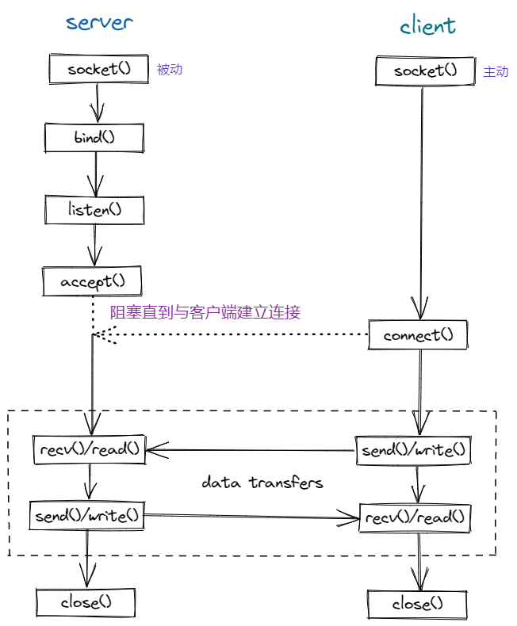

# Unix 域套接字

> Unix 域套接字用于同一主机上的进程间通信。相较于网络套接字，Unix 域套接字仅复制数据，它并不执行协议处理，
> 不需要添加或删除网络报头，无需计算校验和，不产生顺序号，也无需发送确认报文，因此 Unix 域套接字效率更高。
>
> Unix 域套接字提供**流**和**数据报**两种接口。Unix 域数据报服务是可靠的，既不会丢失报文，也不会传递出错。

### 基本功能

- [x] 数据报接口


- [x] 流接口



### 目录结构

```sh
.
├── ./assets
│   ├── ./assets/datagram.png
│   └── ./assets/stream.png
├── ./bin                                       # 案例可执行文件输出目录
│   ├── ./bin/datagram_client
│   ├── ./bin/datagram_server
│   ├── ./bin/stream_client
│   └── ./bin/stream_server
├── ./build                                     # 编译目录
├── ./CMakeLists.txt
├── ./example                                   # 案例目录
│   ├── ./example/CMakeLists.txt
│   ├── ./example/datagram
│   │   ├── ./example/datagram/client.cc
│   │   └── ./example/datagram/server.cc
│   └── ./example/stream
│       ├── ./example/stream/client.cc
│       └── ./example/stream/server.cc
├── ./include
│   ├── ./include/base.h
│   ├── ./include/datagram.h
│   └── ./include/stream.h
├── ./lib
│   └── ./lib/libunix_domain_socket.a           # 库输出目录
├── ./README.md
└── ./src                                       # 库源码
    ├── ./src/base.cc
    ├── ./src/datagram.cc
    └── ./src/stream.cc
```

### build

```sh
mkdir build && cd build
cmake ..
make
```

### run example

> 数据报接口案例

```sh
./bin/datagram_server

# open annother terminal
./bin/datagram_client
```

> 流接口案例

```sh
./bin/stream_server

# open annother terminal
./bin/stream_client
```
