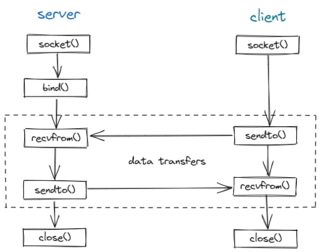

# Unix 域套接字

> Unix 域套接字用于同一主机上的进程间通信。相较于网络套接字，Unix 域套接字仅复制数据，它并不执行协议处理，
> 不需要添加或删除网络报头，无需计算校验和，不产生顺序号，也无需发送确认报文，因此 Unix 域套接字效率更高。
>
> Unix 域套接字提供**流**和**数据报**两种接口。Unix 域数据报服务是可靠的，既不会丢失报文，也不会传递出错。

### 基本功能

- [x] 数据报接口



- [ ] 流接口

### 目录结构

```sh
.
├── ./build                                       # 编译输出
├── ./CMakeLists.txt
├── ./example
│   ├── ./example/CMakeLists.txt
│   ├── ./example/datagram                        # 数据报接口使用案例
│   │   ├── ./example/datagram/client.cc
│   │   ├── ./example/datagram/CMakeLists.txt
│   │   └── ./example/datagram/server.cc
│   └── ./example/stream                          # 流接口使用案例（TODO）
├── ./include
│   ├── ./include/base.h
│   └── ./include/datagram.h
└── ./src
    ├── ./src/base.cc                             # 基础功能
    └── ./src/datagram.cc                         # 数据报接口实现
```

### build

```sh
mkdir build && cd build
cmake ..
make
```

### run example

> 数据报接口案例

```sh
./bin/datagram/server

# open annother terminal
./bin/datagram/client
```
